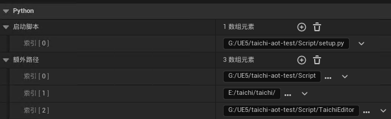
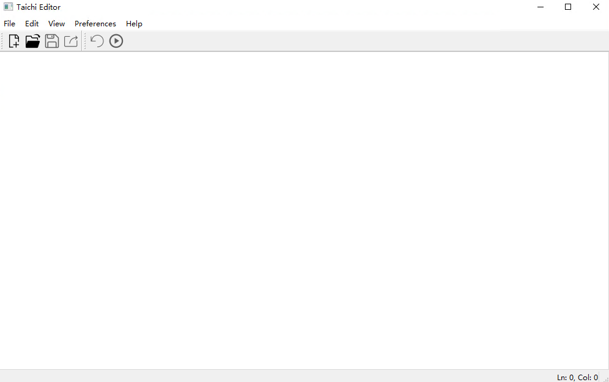

# Taichi Editor in UE5.0

Simple Taichi code editor in UE5.0.


### 1 Install Taichi in UE5

First, you should [enable Python in UE](https://docs.unrealengine.com/5.0/zh-CN/scripting-the-unreal-editor-using-python/) . And then replace your local Python environment with UE Python environment  by changing the environment variable.

Then copy folders:  

from `\path\to\UE_5.0\Engine\Source\ThirdParty\Python3\Win64\libs`  to  `\path\to\UE_5.0\Engine\Binaries\ThirdParty\Python3\Win64\libs`

from `\path\to\UE_5.0\Engine\Source\ThirdParty\Python3\Win64\include`  to  `\path\to\UE_5.0\Engine\Binaries\ThirdParty\Python3\Win64\include`.

To install Taichi in CMD,  please run the following script.

```
git clone --recursive https://github.com/taichi-dev/taichi/
cd taichi
git checkout f5a5b28 # or other version

set TAICHI_CMAKE_ARGS=-DCLANG_EXECUTABLE=/path/to/clang-10.0.0-win/bin/clang++.exe -DLLVM_AS_EXECUTABLE="/path/to/taichi-llvm-10.0.0-msvc2022/llvm-as.exe" -DTI_WITH_VULKAN=ON -DTI_WITH_CUDA=ON -DTI_WITH_C_API=ON -DTI_WITH_LLVM=OFF

python -m pip install  -r requirements_dev.txt
python setup.py develop 
```


### 2 Test Taichi Editor 

- Install PyQt5, QScintilla in UE Python.
- Paste Taichi Editor folder to `\path\to\UEProject\Script\TaichiEditor` and modify the path in `taichi_editor.py`.
- Set `setup.py` as Startup Scripts and include Additional Paths with `\path\to\taichi\`, `\path\to\UEProject\Script`, `\path\to\UEProject\Script\Taichi Editor `.



- Restart the Unreal Editor when done. The next time the Editor loads your Project, it should run your new startup scripts and you will find Taichi Editor  menu.


- Click `Taichi Editor  `, and you can editor python codes in UE5.0.



- When you click 'Compile' button, the command  `python yourcode.py` will run.


#### Reference

- **[PyQtEditor](https://github.com/GitRenhl/PyQtEditor)**