## 场景构建Task
#### 1.布料与场景交互
在ASCharacter类的BeiginPlay()函数，将场景中静态球体的半径，球心坐标传入taichi接口

<br/>

#### 2.布料与人物交互
在ASCharacter类的在Tick()函数，实时计算包围盒，传入taichi接口

<br/>

#### 3.布料与风场交互
在ASCharacter类的OnOffWindpower()函数，改变风力，传入taichi接口

<BR>

#### 4.skeletalmesh显示布料
- 1)InitClothingPosition()函数进行布料位置初始化，传入Taichi接口
- 2)在TICK()调用Taichi接口获取新的位置，进而在UpdateClothingSkeletalMesh()函数更新布料位置
- 3)布料采用skeletalmesh, 需要修改引擎中的代码 SkeletalMeshComponent.h 和 SkeletalMeshComponentPhysics.cpp。
	- 布料系统在yourGitRepoDir\UnrealEngine\Engine\Source\Runtime\Engine\Private\SkeletalRenderGPUSkin.cpp文件中2320行的UpdateClothSimulationData()函数调用 SkeletalMeshComponentPhysics.cpp中的GetCurrentClothingData_AnyThread()函数，获取模拟的布料数据，进一步更新SkeletalMesh的顶点位置，因此将GetCurrentClothingData_AnyThread()函数的返回值更改为Taichi模拟的数据即可。

<BR>

## 场景代码使用
#### 1.修改UE源码并编译
- 1)https://github.com/EpicGames/UnrealEngine 下载源码，切到5.0分支。
- 2)修改yourGitRepoDir\UnrealEngine\Engine\Source\Runtime\Engine\Classes\Components\SkeletalMeshComponent.h 文件，添加两个public变量, 见本分支中SkeletalMeshComponent.h 的 1494-1496行
```
public:
	TMap<int32, FClothSimulData> CurrentSimulationData_Taichi;
	bool IsTaichiSimulation = false
```

- 3)修改
yourGitRepoDir\UnrealEngine\Engine\Source\Runtime\Engine\Private\SkeletalMeshComponentPhysics.cpp文件，修改 GetCurrentClothingData_AnyThread()函数，见本分支中SkeletalMeshComponentPhysics.cpp 的 3848 -3861 行
```
const TMap<int32, FClothSimulData>& USkeletalMeshComponent::GetCurrentClothingData_AnyThread() const
{
	if (!IsValidRef(ParallelClothTask) || ParallelClothTask->IsComplete())
	{
		if (IsTaichiSimulation){ return CurrentSimulationData_Taichi; }
		
		return CurrentSimulationData;
	}

	return SEmptyClothSimulationData;
}
```
- 4)使用vs编译源码，得到UE引擎
<br/>

#### 2.使用编译得到的UE引擎新建或打开项目，UE编辑器中新建一个关卡

<br/>

#### 3.将本分支中assert下的simpleCloth.fbx导入到项目中，勾选Skeletal Mesh选项，点击import all
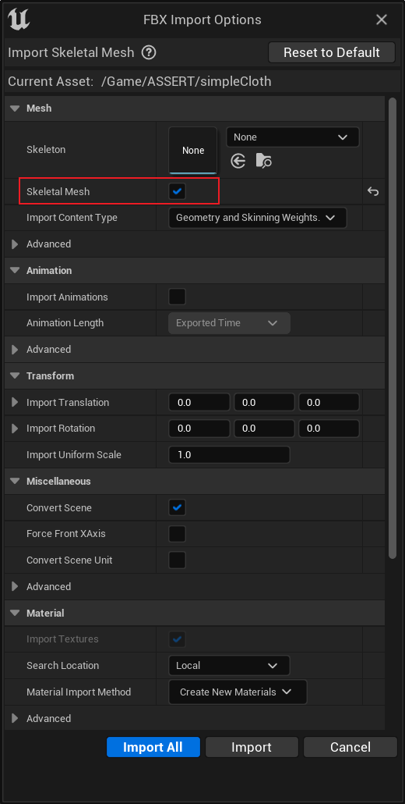

- 1)打开simpleCloth的SkeletalMesh进行编辑,右键mesh点击 Create Clothing Data from Section选项， 点击Create得到 Clothing Data： simpleCloth_Clothing_0
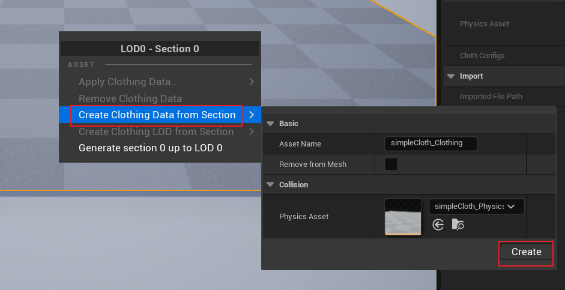

<br>

- 2)选中创建的 simpleCloth_Clothing_0， 点击上方的Activate Cloth Paint选项卡，进入布料编辑模式。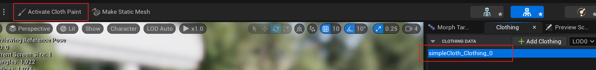

<br>

- 3)调整brush的radius属性，将整个mesh全部刷满布料, 点击上方的Deactivate Cloth Paint选项卡,退出布料编辑模式。
 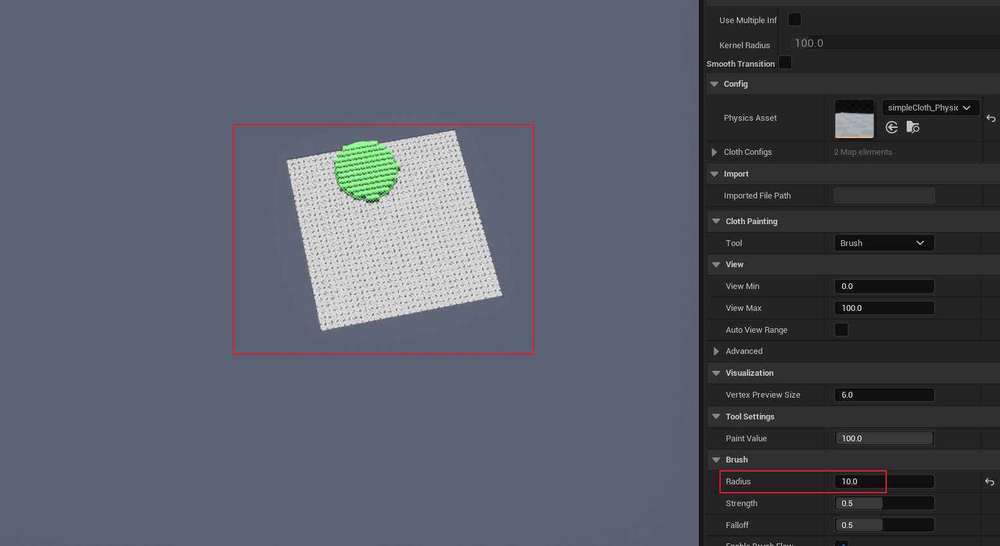

 <br>

 - 4)右键mesh点击 Apply Clothing Data选项,选中编辑好的布料数据，保存。
 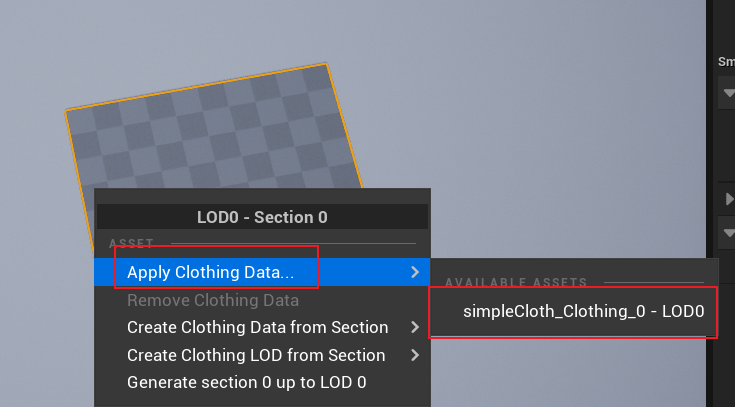

<br/>

#### 4.创建一个继承于SkeletalMeshActor的蓝图类 BP_ClothActor,进入编辑页面,将mesh设置为导入的simplecloth, 调整合适的缩放
 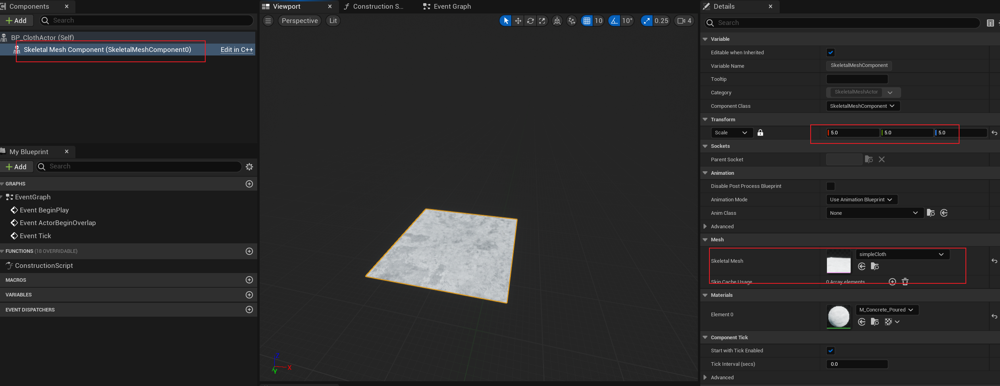

<br/>

#### 5.创建一个继承于Character的C++类， SCharacter， 将本分支中的代码复制到SCharacter.h 和 SCharacter.cpp中
<br/>

#### 6.在项目的build.cs中添加ClothingSystemRuntimeInterface, ChaosCloth两个模块
 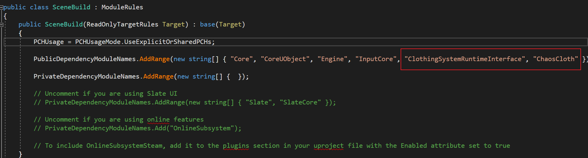

<br/>

#### 7.编译c++代码，运行项目，在UE编辑器中新建一个蓝图类BP_Pawn， 继承于上一步创建的c++类 SCharacter。打开BP_Pawn的编辑面板，设置人物的mesh，动画等资源。查看Capsule Component的Capsule Half Height属性， 将skeletalmesh的Location设置为[0, 0, - Capsule Half Height] (即调整mesh位置、朝向，使得mesh完全在胶囊体内)。添加弹簧臂，相机，调整角色视角
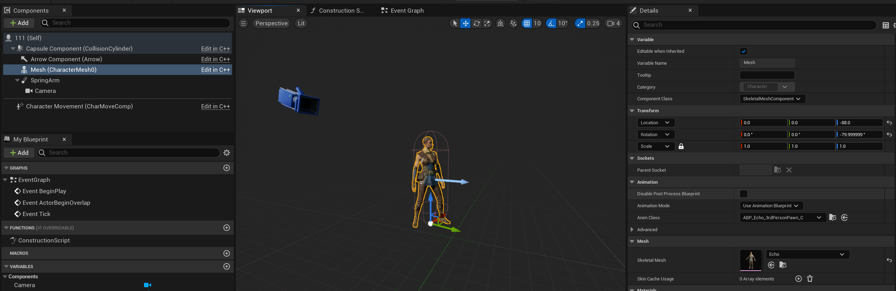

<br/>


#### 8.在BP_Pawn的编辑面板,设置BP_Pawn的cloth属性， ClothActorClass属性设置为创建的蓝图类 BP_ClothActor， ClothLocation为布料位置，ClothSize为布料边长
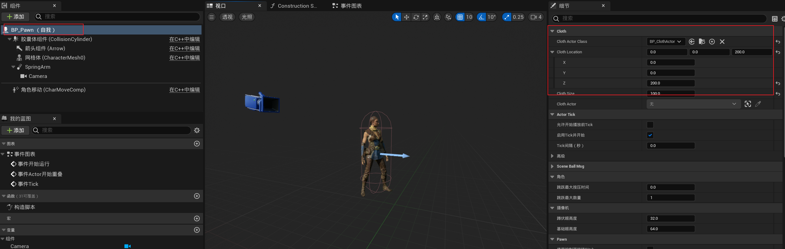

<br>

#### 9.将蓝图类BP_Pawn拖入关卡中，在BP_Pawn实列的细节面板中，将Auto Possess Player 设置为Player0
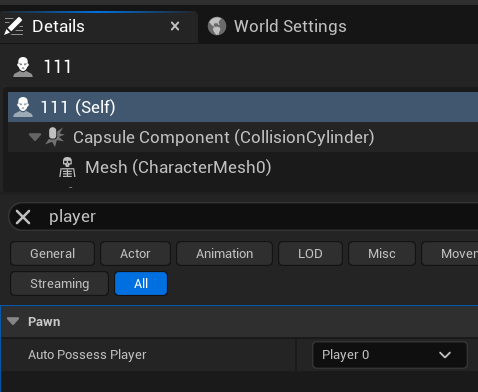

<br/>

#### 10.拖入几个球形的StaticMeshActor到关卡中，在BP_Pawn实列的细节面板中，找到Ball Msg List属性，将场景中的球体属性添加到该属性中。
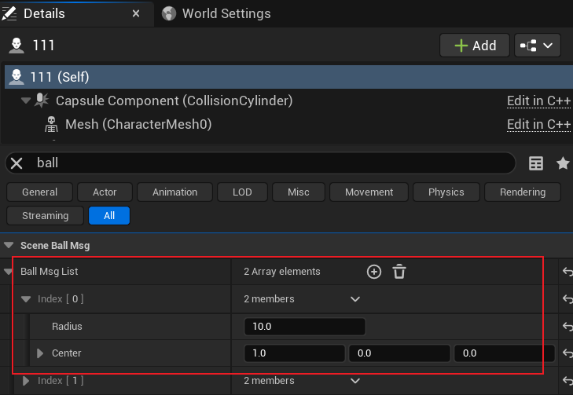

<br/>

#### 11.UE编辑器->编辑->项目设置->Engine->Input， 设置角色的输入
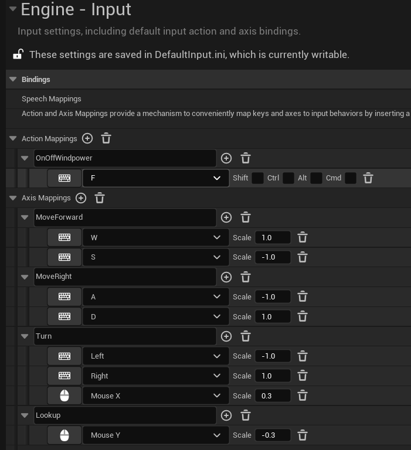
<br/>


#### 12.保存，运行关卡, 演示如下(测试SkeletalMesh顶点变化，非布料模拟效果)


## TODO
- 调用Taichi接口，跑通布料模拟的流程。